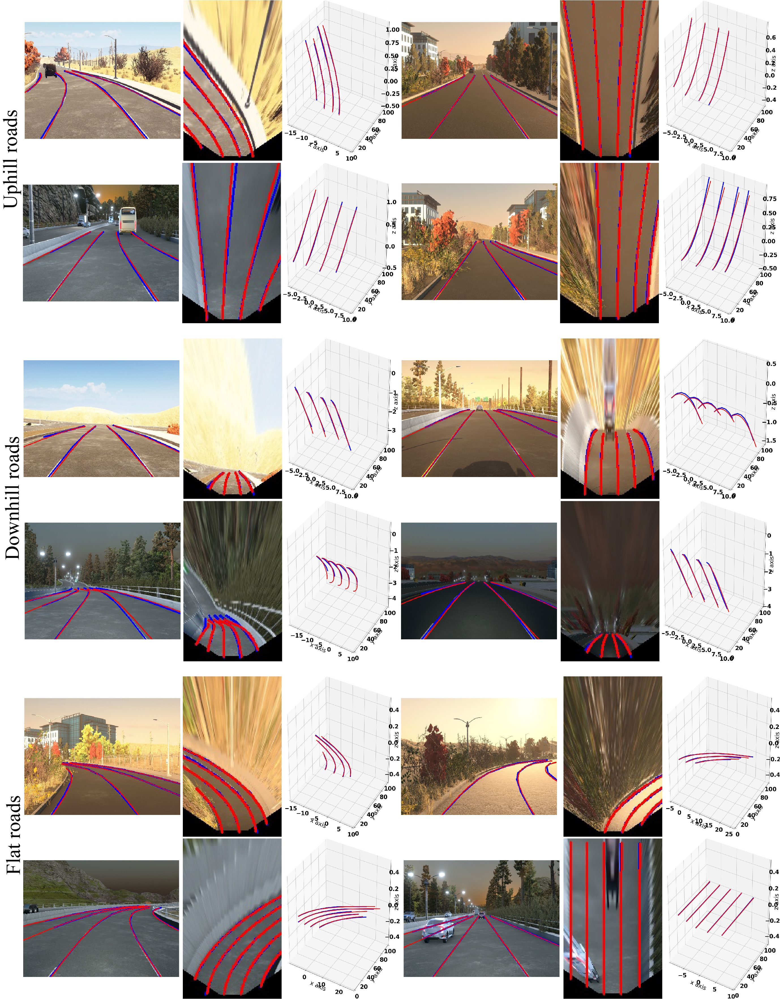
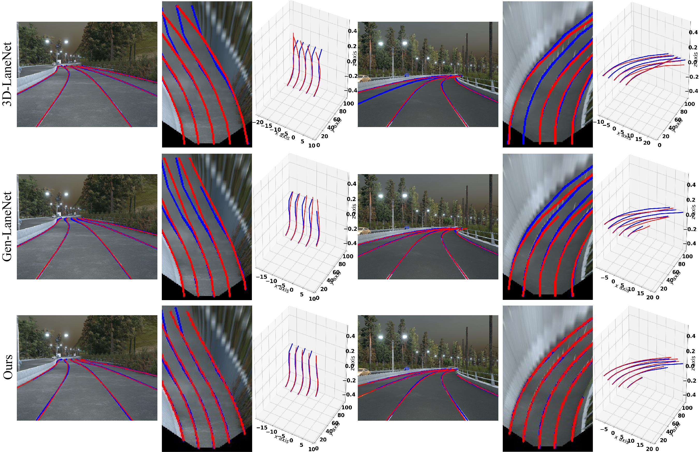

**CLGo**: Learning to Predict 3D Lane Shape and Camera
Pose with Geometry Constraints
=======


PyTorch(1.9.0) training, evaluating and pretrained models for CLGo (Learning to Predict 3D Lane Shape and Camera
Pose with Geometry Constraints).

* Predicting 3D lanes and camera pose from a single image.
* Learning via geometry constraints to improve performances on both tasks.






## Model Zoo
We provide the CLGo model files in the .CLGoZoos/.

## Set Envirionment

* Linux ubuntu 16.04
* GeForce RTX 3090
* Python 3.8.5
* CUDA 11.1

Create virtualenv environment

```
python3 -m venv CLGOENV
```

Activate it

```
source CLGOENV/bin/activate
```

Then install dependencies

```
pip install torch==1.9.1+cu111 torchvision==0.9.1+cu111 torchaudio==0.8.1 -f https://download.pytorch.org/whl/torch_stable.html
pip install -r requirements.txt
```

## Data Preparation
Download and extract ApolloSim from [yuliangguo/3D_Lane_Synthetic_Dataset](https://github.com/yuliangguo/3D_Lane_Synthetic_Dataset)

We expect the directory structure to be the following:
```
./CLGOENV
./CLGoZoos
./Apollo_Sim_3D_Lane_Release
```

## Training

(1) Balanced scenes

```
python joint_train.py IMG_Seq_Pv-Tv_standard
```

(2) Rarely observed scenes

```
python joint_train.py IMG_Seq_Pv-Tv_rare_subset
```

(3) Scenes with visual variations

```
python joint_train.py IMG_Seq_Pv-Tv_illus_chg
```

## Evaluation


(1) Balanced scenes

```
python fast_joint_test.py IMG_Seq_Pv-Tv_standard --test_mode PvTv
```

(2) Rarely observed scenes

```
python fast_joint_test.py IMG_Seq_Pv-Tv_rare_subset --test_mode PvTv
```

(3) Scenes with visual variations

```
python fast_joint_test.py IMG_Seq_Pv-Tv_illus_chg --test_mode PvTv
```

## Acknowledgements

[Gen-LaneNet](https://github.com/yuliangguo/Pytorch_Generalized_3D_Lane_Detection)

